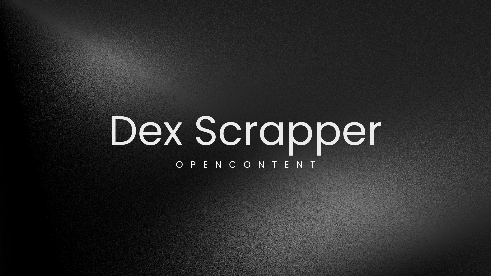
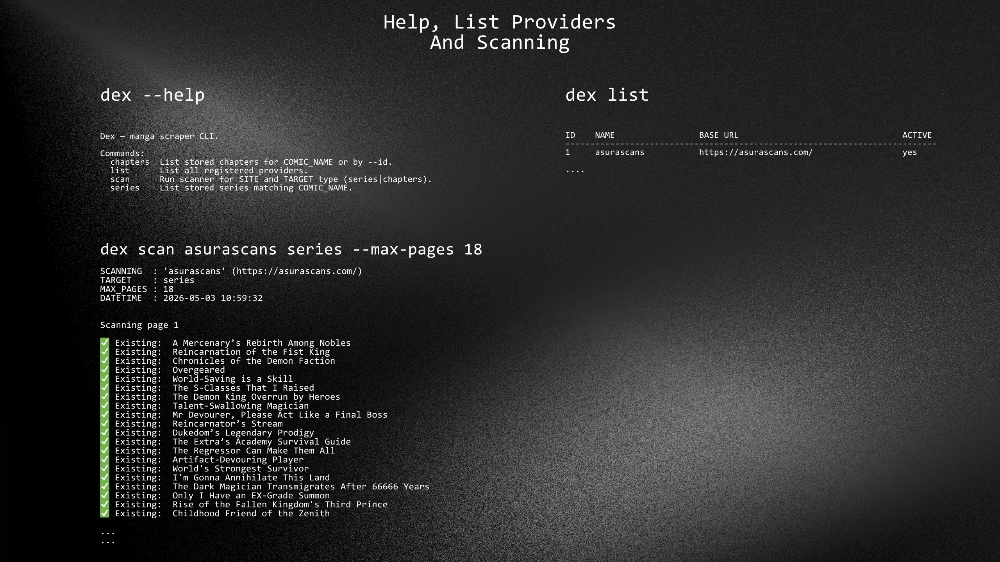

[](https://raw.githubusercontent.com/eirikrrrr/dex/refs/heads/main/pyproject.toml) [](https://github.com/eirikrrrr/dex/tree/main)


A CLI automated to scrape manga/manhwa/dongua, store it in locally in a SQLite, and query it quickly.

Focused on three tasks:

- 🔎 Scan Series & Chapters

- ✏️ Query stored data

- 📜 Export results (`csv` or `json`)

Plus +

- 🔥 No need API KEY 
- 🔥 Easy to install
- 🔥 Your can have your own server with content free scrapping every day with crontabs
- 🔥 Public Database +1GB
    - Manhwa
    - Dongua
    - Manga
    - ComicToons


<br>

Platforms we are scrapping:

- [Asurascans.com](https://asurascans.com)

<br>

## Requirements

- `Python 3.14+`
- `uv`

---

## Quick setup

```bash
uv sync
uv run dex --help
```

If you want to install the command in the virtual environment:

```bash
uv pip install -e .
dex --help
```

---

## Quick usage




### Export series

```bash
# Export all to CSV
uv run dex series --all --export csv --output data/series_all.csv

# Export a specific search to JSON
uv run dex series "Sandmancer" --export json --output data/series_sandmancer.json
```

---

## Available commands

```bash
uv run dex list
uv run dex scan <site> <series|chapters> [--max-pages N]
uv run dex series [COMIC_NAME] [--all] [--limit N] [--export csv|json] [--output FILE]
uv run dex chapters [COMIC_NAME] [--index N]
```

---

## Where data is stored

- SQLite DB: `data/crawler.db`
- Exports: where you point with `--output`

